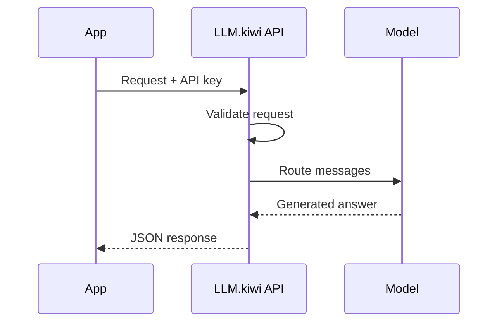

This guide explains the building blocks behind every LLM.kiwi request, with no previous API or AI knowledge required.

<Info>
  Think of an API like ordering at a restaurant: you place an order (send a request), the kitchen prepares it (the model processes it), and you receive your meal (the response).
</Info>

## What is an API?

API stands for **Application Programming Interface**. It is a defined way for two programs to communicate.

With LLM.kiwi:

1. Your code sends a message to the API.
2. LLM.kiwi passes it to an AI model.
3. The API returns the model's answer to your code.

You do not need to download or operate an AI model yourself.

## Base URL and endpoint

The **base URL** is the common address for the API:

```text
https://api.llm.kiwi/v1
```

An **endpoint** is a specific function at that address. The endpoint used for conversations is:

```text
POST https://api.llm.kiwi/v1/chat/completions
```

`POST` means your program sends data to the endpoint.

## Authentication

Every request must include an API key in the `Authorization` header:

```text
Authorization: Bearer sk_kiwi_abc123xyz
```

- `Authorization` is the header name.
- `Bearer` is the authentication scheme and must include the space after it.
- `sk_kiwi_...` is your private key.

<Warning>
  An API key is a password for programmatic access. Store it in an environment variable, never expose it in browser-side code, and revoke it in the [dashboard](https://llm.kiwi/dashboard) if it leaks.
</Warning>

## JSON request body

JSON is a text format for structured data. A basic request body looks like this:

```json
{
  "model": "auto",
  "messages": [
    { "role": "user", "content": "What is the capital of France?" }
  ]
}
```

JSON uses double quotes around names and text. Items are separated by commas.

## Messages and roles

The `messages` array contains the conversation. Each message has a `role` and `content`.

| Role | Meaning | Example |
| --- | --- | --- |
| `system` | Instructions for how the assistant should behave | `You are a concise tutor.` |
| `user` | Input from your user or application | `Explain gravity.` |
| `assistant` | A previous AI response included as conversation history | `Gravity attracts objects.` |

### System instructions

Place a system message first when you want consistent behavior:

```json
{
  "messages": [
    { "role": "system", "content": "Answer in simple Croatian." },
    { "role": "user", "content": "Objasni što je API." }
  ]
}
```

System instructions guide the model but should not be treated as a security boundary. Validate important outputs in your own application.

### Multi-turn conversations

The API does not remember earlier requests automatically. To continue a conversation, send the relevant history again:

```json
{
  "messages": [
    { "role": "user", "content": "My name is Alice." },
    { "role": "assistant", "content": "Hi Alice!" },
    { "role": "user", "content": "What is my name?" }
  ]
}
```

<Note>
  Longer history uses more tokens. Keep the messages that matter and summarize or remove old content when conversations grow.
</Note>

## Models

A model is the AI system that generates the response.

| Model | What it does | Recommended use |
| --- | --- | --- |
| `auto` | Selects an available model automatically | Default for most applications |
| `hrllm` | Focuses on Croatian-language generation | Croatian content and conversations |

If you are unsure, start with `auto`. See [Models](/models) for current details.

## Tokens

Models process text in **tokens**, which are small pieces of words and punctuation. A token is not always a complete word.

Tokens matter because:

- Your input and conversation history consume input tokens.
- The generated answer consumes output tokens.
- Each model has a maximum context size.
- Service limits may be measured using tokens.

The `usage` object in a response reports token counts when available.

## Response format

A successful response is JSON. The value most applications need is `choices[0].message.content`:

```json
{
  "id": "chatcmpl-abc123",
  "object": "chat.completion",
  "model": "auto",
  "choices": [
    {
      "index": 0,
      "message": {
        "role": "assistant",
        "content": "Paris is the capital of France."
      },
      "finish_reason": "stop"
    }
  ],
  "usage": {
    "prompt_tokens": 15,
    "completion_tokens": 8,
    "total_tokens": 23
  }
}
```

| Field | Meaning |
| --- | --- |
| `choices[0].message.content` | The generated answer |
| `model` | The model reported for the request |
| `usage` | Input, output, and total token counts |
| `finish_reason` | Why generation ended; `stop` is a normal completion |

## Request lifecycle



## Errors

Responses use HTTP status codes:

| Status | Meaning |
| --- | --- |
| `200` | Request succeeded |
| `400` | Request data is invalid |
| `401` | API key is missing or invalid |
| `429` | A rate limit was reached |
| `500` or `503` | Temporary server or model issue |

Your code should check the status, show a useful message, and retry only temporary failures. See [Error reference](/errors).

## Next steps

<CardGroup cols={2}>
  <Card title="Make your first request" icon="rocket" href="/quickstart">
    Follow the complete beginner quickstart.
  </Card>

  <Card title="Explore models" icon="brain" href="/models">
    Choose the best model for your task.
  </Card>

  <Card title="Use a working example" icon="code" href="/examples">
    Copy complete Python, JavaScript, and cURL examples.
  </Card>

  <Card title="Look up a term" icon="book" href="/glossary">
    Use the plain-language glossary.
  </Card>
</CardGroup>