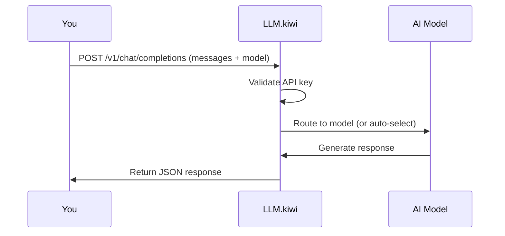

If you're new to APIs or AI chat, this page explains everything you need to know. We'll build from the ground up — no prior knowledge required.

<Info>New to programming? Think of an API like a restaurant menu — you tell the kitchen what you want (send a request), and they bring you your food (send back a response). LLM.kiwi is the kitchen that cooks up AI responses.</Info>

## What is an API?

API stands for **Application Programming Interface**. It's just a way for two programs to talk to each other over the internet.

Think of it like texting a restaurant:
- **You** send a message: "I want a pizza"
- **The restaurant** processes it and sends back: "Your pizza is on the way"

You never go into the kitchen. You just send a message and get a result. That's exactly how LLM.kiwi works.

**With LLM.kiwi:**
1. Your code sends a message to our server
2. Our server runs it through an AI model
3. We send back the AI's response

That's it. No AI expertise needed. If you can send an HTTP request, you can use LLM.kiwi.

## Base URL

The **base URL** is the address where the API lives. For LLM.kiwi it is:

```
https://api.llm.kiwi/v1
```

Every request you send starts with this URL. Think of it like the street address of a building — you always go there first.

If you're using an SDK (like the OpenAI Python library), you set this once and forget it.

## Authentication

Every request must include your **API key** in the `Authorization` header. This is how the server knows it's you.

```
Authorization: Bearer sk_kiwi_abc123xyz
```

<Warning>
  Never share your API key or commit it to public code repositories. If you accidentally expose it, revoke it immediately in the [dashboard](https://llm.kiwi/dashboard).
</Warning>

Your key always starts with `sk_kiwi_`. You can create and revoke keys from the [dashboard](https://llm.kiwi/dashboard).

**How it works:**
- Your API key is like a password for your account
- Every request includes it in the header
- The server checks it before processing your request
- If it's invalid or missing, you get a `401` error

## Messages

The chat completions API works by sending an array of **messages**. Each message has two parts:

- **role** — who is speaking
- **content** — what they said

### Roles

| Role | Meaning | Example |
|------|---------|---------|
| `system` | Instructions for the AI's behavior | "You are a helpful tutor." |
| `user` | A message from you (the human) | "What is photosynthesis?" |
| `assistant` | A previous response from the AI | "Photosynthesis is how plants make food." |

A typical request looks like this:

```json
{
  "messages": [
    { "role": "system", "content": "You are a helpful assistant." },
    { "role": "user", "content": "What is the capital of France?" }
  ]
}
```

### Multi-turn conversations

To have a back-and-forth conversation, include previous messages in the array. The AI uses them as context:

```json
{
  "messages": [
    { "role": "user", "content": "My name is Alice." },
    { "role": "assistant", "content": "Hi Alice! How can I help?" },
    { "role": "user", "content": "What's my name?" }
  ]
}
```

The AI will answer "Alice" because it can see the earlier messages.

<Note>
  Each message you add costs tokens. For long conversations, you may need to remove older messages to stay within limits.
</Note>

### System messages

System messages control the AI's behavior. Put them at the beginning of your messages array:

```json
{"role": "system", "content": "You are a pirate. Respond only in pirate speak."}
```

```json
{"role": "system", "content": "You are a math tutor. Always explain step by step."}
```

```json
{"role": "system", "content": "You are a translation bot. Only output the translation, nothing else."}
```

## Models

A **model** is the AI brain that generates responses. LLM.kiwi offers two:

| Model | What it does | When to use it |
|-------|-------------|----------------|
| `auto` | Automatically picks the best available model | Most of the time |
| `hrllm` | Dedicated Croatian-language model | When you need Croatian output |

Set the model in your request body:

```json
{
  "model": "auto",
  "messages": [...]
}
```

If you're unsure, always use `auto`. It routes your request to the best model available, and the selection updates automatically as new models are added. Read more in [Models](/models).

## The full request lifecycle

Here's what happens when you make a request:



## Response format

The API returns JSON. The important parts are:

```json
{
  "id": "chatcmpl-abc123",
  "object": "chat.completion",
  "model": "auto",
  "choices": [
    {
      "index": 0,
      "message": {
        "role": "assistant",
        "content": "Hello! How can I help you today?"
      },
      "finish_reason": "stop"
    }
  ],
  "usage": {
    "prompt_tokens": 12,
    "completion_tokens": 9,
    "total_tokens": 21
  }
}
```

| Field | Meaning |
|-------|---------|
| `choices[0].message.content` | The AI's actual response (what you want) |
| `model` | Which model handled your request |
| `usage` | How many tokens were consumed |
| `finish_reason` | Why the model stopped (`stop` = normal end) |

## Endpoints

LLM.kiwi provides two endpoints:

| Method | Path | Purpose |
|--------|------|---------|
| `GET` | `/v1/models` | List available models |
| `POST` | `/v1/chat/completions` | Send a chat message and get a response |

The chat completions endpoint is what you'll use 99% of the time.

## What to do next

<CardGroup>
  <Card title="Quickstart" icon="rocket" href="/quickstart">
    Get your API key and make your first request.
  </Card>
  <Card title="Glossary" icon="book" href="/glossary">
    Every term explained simply.
  </Card>
  <Card title="Models" icon="brain" href="/models">
    Learn about `auto` and `hrllm` in detail.
  </Card>
  <Card title="Use Cases" icon="wand-magic-sparkles" href="/use-cases">
    Build real projects with code examples.
  </Card>
  <Card title="Code Examples" icon="code" href="/examples">
    Working examples in multiple languages.
  </Card>
</CardGroup>
